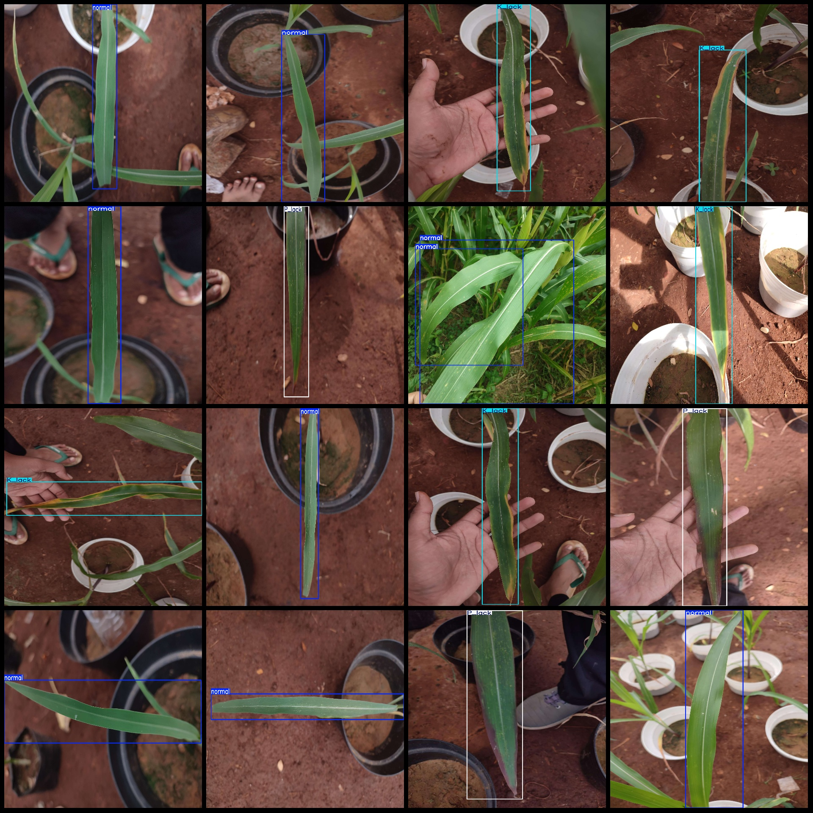
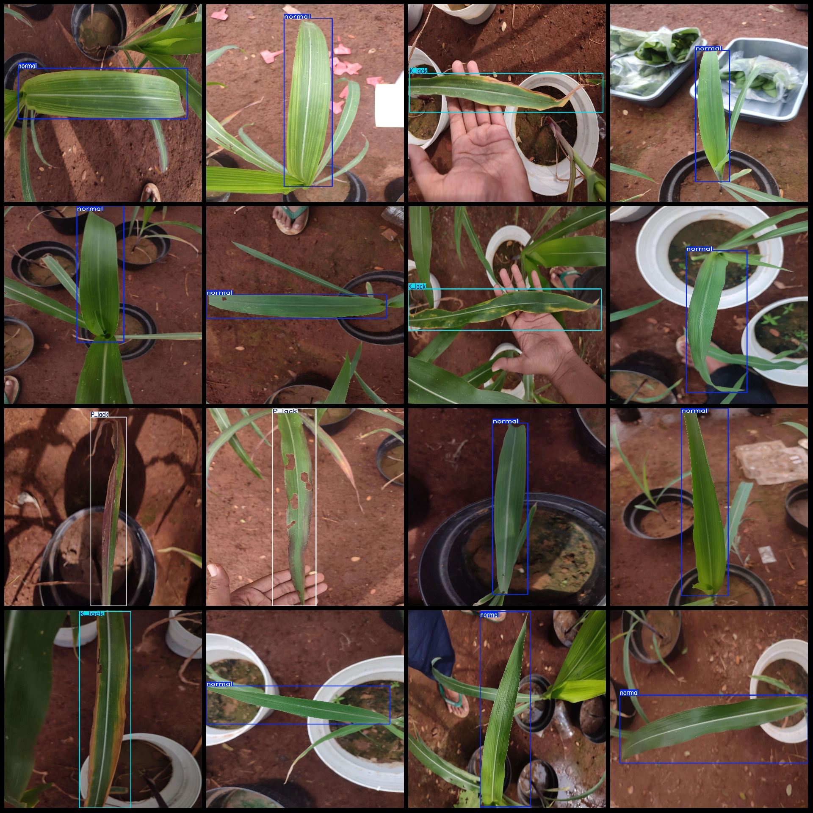

# Smart Agriculture Maize Shoots Nutrient Detection Dataset (VOC+YOLO) - 663 Images in 3 Categories

**Dataset Format:** Pascal VOC format + YOLO format (txt file without split path, only containing jpg images and corresponding VOC format xml files and YOLO format txt files)

**Number of Images (jpg Files):** 663

**Number of Annotations (xml Files):** 663

**Number of Annotations (txt Files):** 663

**Number of Annotation Categories:** 3

**Label Order in "labels" folder (consider the order in yolo format is different from this, but according to labels.txt):** ["K_lack", "P_lack", "normal"]

**Box Count per Category:**  
K_lack (Deficient Potassium) Boxes = 175  
P_lack (Deficient Phosphorus) Boxes = 145  
normal (Normal Nutrient) Boxes = 371  
Total Boxes = 691  

**Images per Category:**  
K_lack (Deficient Potassium) Images = 167  
P_lack (Deficient Phosphorus) Images = 142  
normal (Normal Nutrient) Images = 355  

**Image Resolution:** Multi-resolution images, e.g., 1920x2560, 1920x1440, etc.

**Annotation Tool:** labelImg

**Annotation Rules:** Draw boxes for categories

**Important Note:** The dataset does not have been split into training, validation, or test sets; you need to do so yourself.

**Special Disclaimer:** This dataset does not guarantee any accuracy in the trained models or weight files.

**Image Preview:**

**Annotation Example:**

## Images

Here is a pay link on Stripe ( https://buy.stripe.com/3cs8yP7sY87d0vu9AB ). Please contact me lonlonago@foxmail.com after funding $89, and I will send you a complete data files , thank you!

